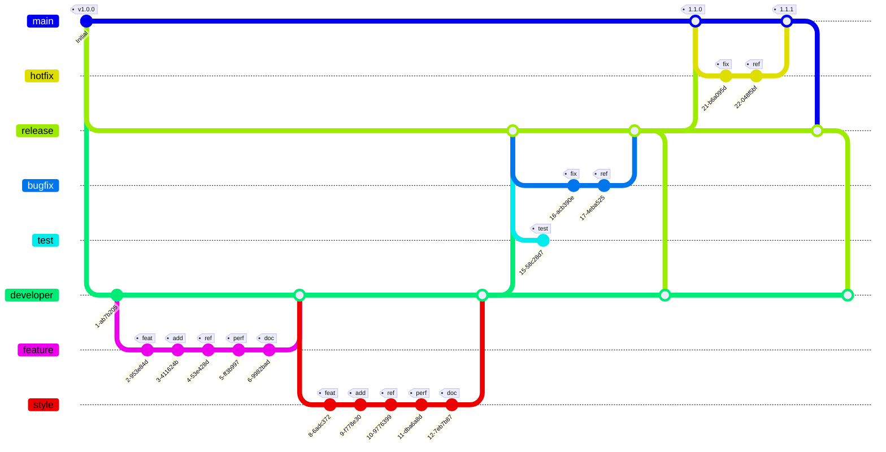

# Git Workflow

```mermaid
gitGraph
  commit id: "Initial" tag: "v1.0.0"
  branch release order: 2
  checkout release

  branch developer order: 5
  checkout developer
  commit

  branch feature order: 6
  checkout feature
  commit tag: "feat"
  commit tag: "add"
  commit tag: "ref"
  commit tag: "perf"
  commit tag: "doc"

  checkout developer
  merge feature


  branch style order: 7
  checkout style
  commit tag: "feat"
  commit tag: "add"
  commit tag: "ref"
  commit tag: "perf"
  commit tag: "doc"

  checkout developer
  merge style

  checkout release
  merge developer

  branch test order: 4
  checkout test
  commit tag: "test"

  checkout release

  branch bugfix order: 3
  checkout bugfix
  commit tag: "fix"
  commit tag: "ref"

  checkout release
  merge bugfix

  checkout developer
  merge release

  checkout main
  merge release tag: "1.1.0"

  branch hotfix order: 1
  checkout hotfix
  commit tag: "fix"
  commit tag: "ref"

  checkout main
  merge hotfix tag: "1.1.1"

  checkout release
  merge main

  checkout developer
  merge release
```
